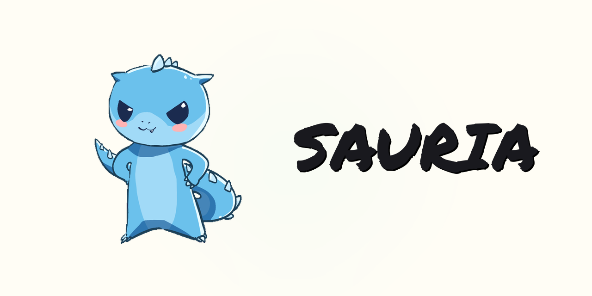

<p align="center">
  
</p>

<p align="center">
  <strong>The Solo AI Agency</strong><br/>
  Deploy autonomous AI agents that collaborate like a real team across every platform, with shared memory and 60+ integrations.
</p>

<p align="center">
  <a href="https://github.com/opensauria/sauria/releases"><strong>Download</strong></a> &nbsp;&middot;&nbsp;
  <a href="https://sauria.dev">Website</a> &nbsp;&middot;&nbsp;
  <a href="https://github.com/opensauria/sauria#install">Install</a> &nbsp;&middot;&nbsp;
  <a href="https://github.com/opensauria/sauria/blob/main/LICENSE">License</a>
</p>

---

Run a 100-person company. Alone.

Sauria is your AI workforce. Specialized agents that own their roles — sales, support, marketing, ops — collaborating autonomously 24/7. They share a unified knowledge graph, coordinate across platforms, and operate on your machine. No cloud dependency. Your data, your agents, your rules.

## Features

- **AI Workforce** — Deploy specialized AI agents that collaborate like a real team. Each agent owns its role, 24/7.
- **Multi-Agent Orchestration** — Visual canvas to wire agents together. Define handoffs, routing rules, and escalation paths.
- **Multiplatform Bots** — Your agents live where your customers are. Slack, Discord, WhatsApp, email, SMS. One agent, every channel.
- **Shared Knowledge Graph** — Every agent shares a unified memory. Your sales agent knows what support promised, and vice versa.
- **MCP-Native** — Built on the Model Context Protocol. Plug into Claude, Cursor, Windsurf, or any MCP client. Open standard, zero lock-in.
- **Runs Locally** — Your entire agency runs on your machine. Encrypted at rest. No cloud dependency.

## Install

```bash
# macOS / Linux
curl -fsSL https://install.sauria.dev | sh

# npm
npm install -g @sauria/cli
```

Requires Node.js 24+. The installer runs the setup wizard, stores credentials in an encrypted vault, and starts the background daemon.

macOS &middot; Linux &middot; Windows &middot; Docker

## CLI

```bash
sauria                    # Show status (or onboard if first run)
sauria ask "Who is Marc?" # Natural language query
sauria teach "Marc is CTO of ClientX"
sauria status             # System overview
sauria upcoming           # Deadlines in next 24h
sauria insights           # AI-generated observations
sauria doctor             # Health checks
```

| Command                    | Description                       |
| -------------------------- | --------------------------------- |
| `sauria onboard`           | Interactive setup wizard          |
| `sauria daemon`            | Start background daemon           |
| `sauria ask <question>`    | Natural language query            |
| `sauria interactive`       | Interactive REPL mode             |
| `sauria status`            | System overview                   |
| `sauria focus <entity>`    | Deep dive on an entity            |
| `sauria entity <name>`     | Look up entity details            |
| `sauria upcoming [hours]`  | Upcoming deadlines (default: 24h) |
| `sauria insights`          | AI-generated observations         |
| `sauria teach <fact>`      | Add knowledge manually            |
| `sauria sources`           | List configured data sources      |
| `sauria mcp-server`        | Start MCP server (stdio)          |
| `sauria doctor`            | Run health checks                 |
| `sauria audit [count]`     | Show audit log                    |
| `sauria export`            | Encrypted backup                  |
| `sauria purge`             | Secure delete all data            |
| `sauria import <file>`     | Import data                       |
| `sauria connect <channel>` | Connect a channel                 |
| `sauria config`            | Show current config               |

## Desktop App

- **Squad** — Infinite viewport where you place and connect AI agents visually. Drag agents from the dock, draw edges to define communication routes, create workspace frames to group teams.
- **Brain** — Knowledge graph visualization with entity search, relations, and timeline.
- **Integrations** — 60+ service connections with OAuth/API key management.
- **Command Palette** — Quick access to all commands via `Cmd+Shift+J`.
- **Setup Wizard** — Guided configuration for API keys, providers, and MCP client registration.
- **Tray Icon** — Daemon status, quick actions, always running in background.

## MCP Tools

When running as an MCP server, Sauria exposes 11 tools to connected agents:

| Tool                       | Description                                             |
| -------------------------- | ------------------------------------------------------- |
| `sauria_query`             | Natural language question answered from knowledge graph |
| `sauria_get_entity`        | Entity details + relations + timeline                   |
| `sauria_search`            | Hybrid semantic + keyword search                        |
| `sauria_get_upcoming`      | Deadlines and meetings in next N hours                  |
| `sauria_get_insights`      | AI-generated observations and patterns                  |
| `sauria_get_context_for`   | Full context dump for a topic                           |
| `sauria_add_event`         | Feed an event into the knowledge graph                  |
| `sauria_remember`          | Store structured knowledge (entities + relations)       |
| `sauria_pending_approvals` | List pending approval requests from agents              |
| `sauria_approve`           | Approve a pending action by ID                          |
| `sauria_reject`            | Reject a pending action by ID                           |

All inputs validated. Rate limited. Audit logged.

## Integrations

60+ integrations. Your AI workforce operates across your entire stack.

Gmail &middot; Slack &middot; Discord &middot; WhatsApp &middot; Telegram &middot; Notion &middot; Google Calendar &middot; Google Drive &middot; Obsidian &middot; Airtable &middot; GitHub &middot; GitLab &middot; Docker &middot; Supabase &middot; Vercel &middot; Linear &middot; Jira &middot; Asana &middot; Trello &middot; PostgreSQL &middot; MongoDB &middot; Redis &middot; Sentry &middot; Datadog &middot; Grafana &middot; Stripe &middot; Shopify &middot; HubSpot &middot; Figma &middot; Zapier &middot; n8n &middot; Zendesk &middot; and more.

## Configuration

Config lives at `~/.sauria/config.json5`:

```json5
{
  models: {
    extraction: { provider: 'google', model: 'gemini-2.5-flash' },
    reasoning: { provider: 'anthropic', model: 'claude-sonnet-4-5' },
    deep: { provider: 'anthropic', model: 'claude-opus-4-6' },
  },
  budget: { dailyLimitUsd: 5.0, warnAtUsd: 3.0 },
  owner: {
    telegram: { userId: 123456789 },
  },
}
```

## Cross-Platform

| Platform           | Install          | Daemon         |
| ------------------ | ---------------- | -------------- |
| macOS (ARM/Intel)  | curl / npm       | launchd        |
| Linux x86_64/ARM64 | curl / npm       | systemd        |
| Windows 10/11      | PowerShell / npm | Task Scheduler |
| Docker             | docker compose   | Container      |

## License

AGPL-3.0 — see [LICENSE](LICENSE).
